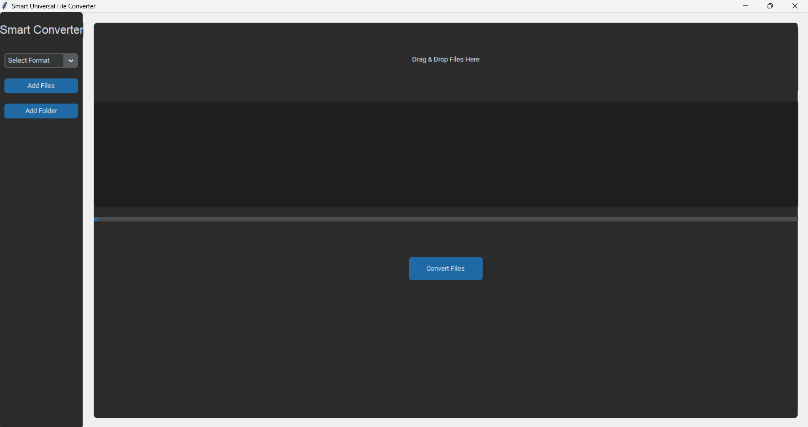
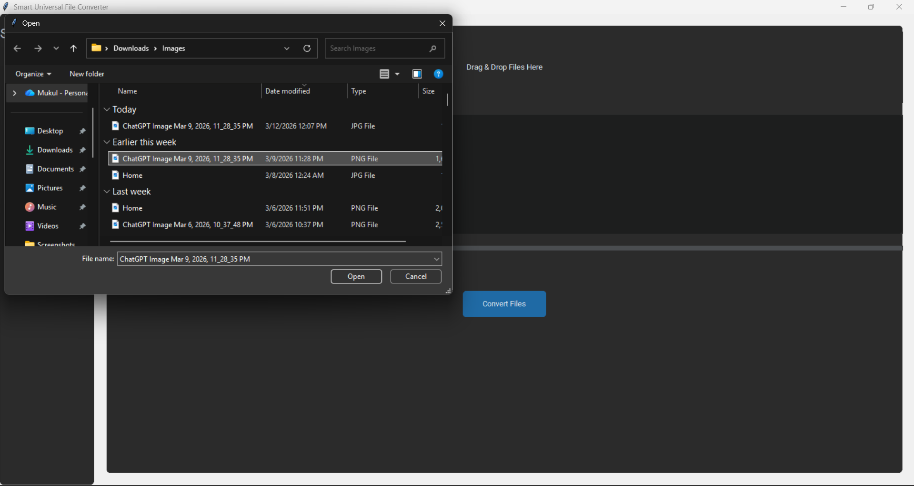
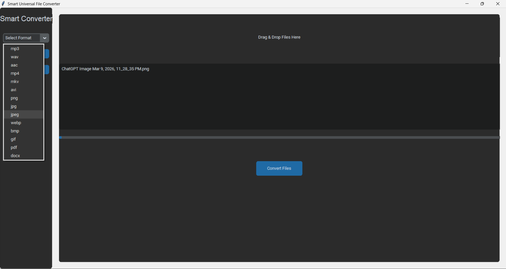
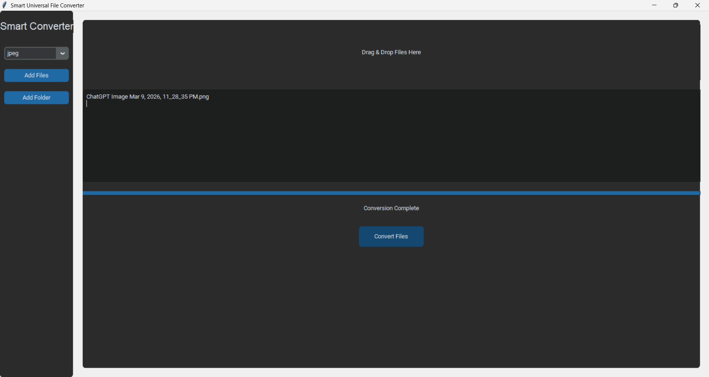

# Smart Universal File Converter



A modern **Python desktop application** that allows users to convert files between multiple formats including **images, videos, audio, and documents**.
The application provides a **clean graphical interface**, drag-and-drop support, batch conversion, and easy file selection.

---

## Features

* Modern graphical interface
* Convert multiple file formats
* Drag & drop file support
* **Add Files** button for easy file selection
* **Add Folder** option for batch conversion
* Convert multiple files at once
* Progress bar showing conversion status
* Image and video preview
* PDF and Word document conversion

---

## Supported Conversions

### Images

* PNG → JPG
* JPG → PNG
* WEBP → PNG
* BMP → JPG

### Videos

* MP4 → MP3
* MKV → MP4
* AVI → MP4

### Audio

* WAV → MP3
* AAC → MP3

### Documents

* PDF → DOCX
* DOCX → PDF

---

## Application Screenshots

### Main Interface


### Add Files



### Choose Conversion Type



### Conversion Process



---

## Technologies Used

* Python
* CustomTkinter (Modern GUI)
* FFmpeg (Media conversion engine)
* Pillow (Image processing)
* OpenCV (Video preview)
* pdf2docx (PDF to Word conversion)
* docx2pdf (Word to PDF conversion)

---

## Installation

### 1. Clone the repository

```
git clone https://github.com/mukul1006/file-converter.git 
cd file-converter
```

### 2. Install required libraries

```
pip install customtkinter tkinterdnd2 pillow opencv-python pdf2docx docx2pdf
```

### 3. Install FFmpeg

Download and install FFmpeg, then add it to your system PATH.

---

## Running the Application

Run the application using:

```
python main.py
```

---

## How to Use

1. Start the application.
2. Select the output format from the **format dropdown**.
3. Add files using:

   * **Add Files**
   * **Add Folder**
   * **Drag & Drop**
4. Click **Convert Files**.
5. The converted files will appear in the same folder as the original files.

---

## Project Structure

```
file_converter
│
├── main.py
├── converter.py
├── README.md
│
├── icons
│   ├── image.png
│   ├── video.png
│   ├── audio.png
│   └── file.png
│
└── screenshots
    ├── main-ui.png
    ├── add-file.png
    ├── choose-conversion-type.png
    └── conversion.png
```

---

## Future Improvements

* Support for 100+ file formats
* Conversion queue system
* Faster multi-thread conversion
* File compression options
* Export application as a `.exe` installer

---

## Author

Created by **Mukul Kumar** as a portfolio project demonstrating Python GUI development and file conversion automation.

---
